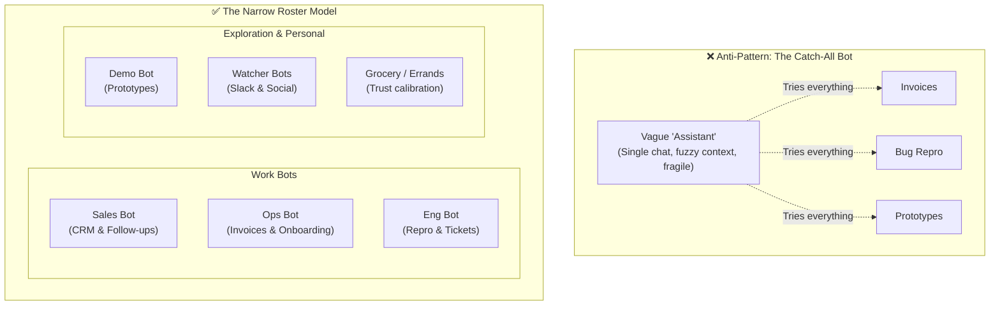

# 01. Steal the roster before you invent one

Most people open the app, stare at "create a bot", and end up with something vague called Assistant. The teams in the source article never did: their bots were narrow from day one, and the roster is public.

## The actual rosters

**Inside SpaceXAI:**

| Bot | Job |
|---|---|
| Sales bot | Pulls notes out of call transcripts, updates the CRM, drafts follow-ups |
| Ops bot | Seats new hires, processes invoices sitting in Gmail |
| Engineering bot | Reproduces a bug in the product UI and files the ticket |

**Cursor side (Matt Palmer runs five):**

| Bot | Job |
|---|---|
| Demo bot | Turns his bookmarks into working prototypes |
| Content bot | Watches Slack hourly for small ships |
| Product bot | Summarizes announcements daily |
| Grocery bot | Compares carts across delivery services weekly |
| DoorDash bot | Watches for group-order links |

Note that half of Palmer's roster has nothing to do with his job. That's deliberate (see [09. Errands](09-errands.md)).

Fiona from community, on why onboarding felt easy:

> "There wasn't anything to learn. It was just like bringing on a coworker. No automations to set up, no product quirks, no intricate naming. You're just chatting with a friend."

## The move

Pick two roles from these lists that map onto your week. You are not designing an org chart; you are copying one that already works.

The principle the docs put in one sentence: **"Focused Bots build more useful context than one catch-all Bot."** Narrow scope is what lets each bot's profile file get sharp.
