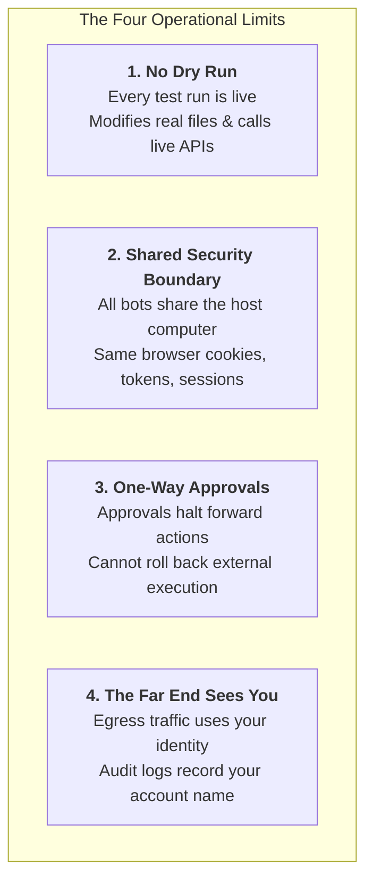

# 02. The four limits

Read this before connecting anything. Everything after it is easier to trust once you know what you are actually agreeing to.

1. **No dry run.** A test run does real work: it navigates sites, changes files, calls connected tools. Your first run is a live run.
2. **Bots are not a security boundary.** Every bot on your account shares one computer: same files, same sessions, same logins. Your Expense Manager reaches everything your Talent Scout reaches.
3. **Approvals prevent, they do not reverse.** Sensitive actions stop for you and 2FA hands back the screen, but the session stays live afterwards for every bot you own. Auto Review is a model checking a model.
4. **The far end sees you.** The bot acts inside your session, so logs on the other side show your name. No queryable audit log yet; no SOC 2 / ISO 27001 / GDPR / HIPAA claims in the docs at the time of writing.

And a fifth limit, on the bill, from an early tester:

> "I've used more tokens this month than not this month... I've used less tokens in the last 5 years prior to this month than I have this month."

Weekly allowances, uncapped per-token overage, no documented spend cap.

## Why this matters

None of this makes the product bad. It makes it a coworker with your credentials rather than a sandbox, and that changes what you hand it first.

Every section that follows assumes you have read this one. (For a deep dive on the security implications of agent runtimes, see the hardening sweep that motivated this repo's sibling work: least-privilege tokens, egress allowlists, and audit trails are the answer to limits 2-4.)
