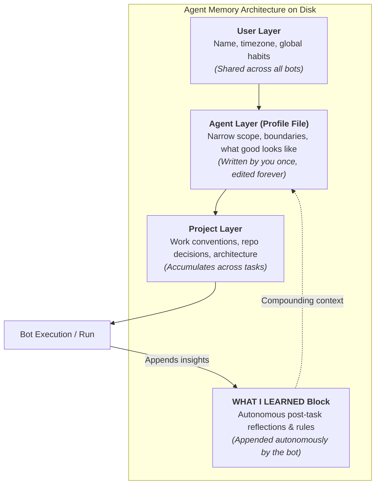

# 03. The bot is a file, not a chat window

One line in Palmer's writeup reframes the whole product, and it went past almost everyone: **a bot's memory is a profile file.** He compares it to an AGENTS.md: a top-level definition of that bot sitting on disk, plus a running log of every interaction.

You are not prompting. You are editing a document that survives every conversation you will ever have with that bot.

## The three memory layers

| Layer | Contents | Who writes it |
|---|---|---|
| User | Name, timezone, preferences | Shared across every bot; any bot can update it |
| Agent | That bot's own profile plus its interaction history | You (the layer you spend the real half hour on, once) |
| Project | Decisions and conventions that belong to the work, not one teammate | Accumulates from the work |



The docs put it in a sentence: "Focused Bots build more useful context than one catch-all Bot." Narrow scope is what lets the file get sharp.

## The agent file, annotated

```markdown
// the agent file. write it once, edit it forever.
I am the Paid Media bot. I own weekly spend reporting. Nothing else.

WHAT I PULL
Spend and performance by campaign from the ad dashboards.
Budget and target CAC from [doc link].

WHAT GOOD LOOKS LIKE
Five bullets. Source links inline. A number behind every claim.
Final section always called "Decisions needed".

WHAT I NEVER DO
Change a budget. Pause or launch a campaign. Talk to a vendor.
Anything that spends money: I show the amount and I wait.

WHAT I LEARNED
[the bot appends here. leave it room.]
```

That last block is not decoration. It gives the file room to grow without you.
