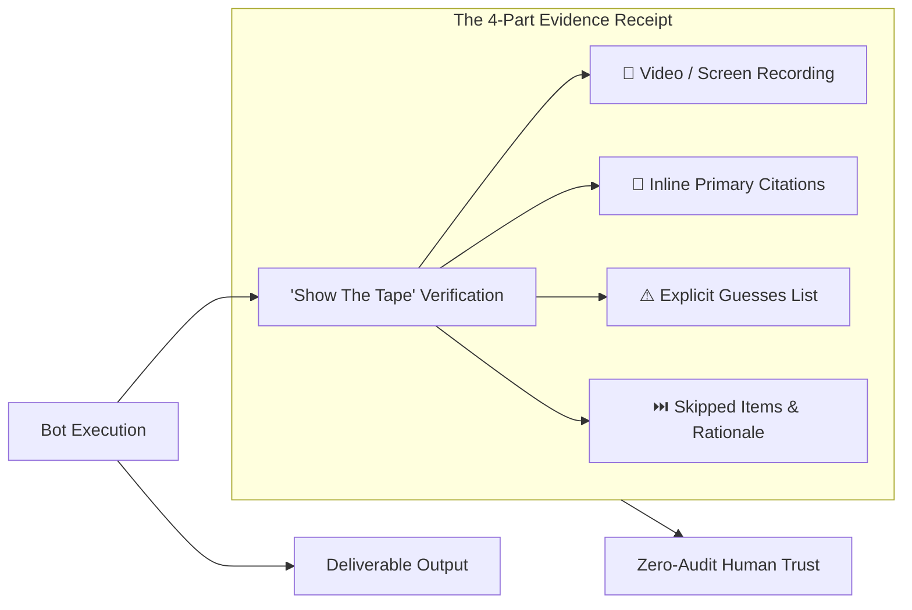

# 04. Make it show you the tape

The mechanic that lets you stop double-checking everything: **every agent validates its work with a screen recording.** Palmer:

> "Every agent validates work via screen recordings, so I can be sure it is doing what it should."

You are not reading a summary of what the bot says it did. You are watching it happen. Stop asking for the result. Ask for the result plus the evidence, and you can hand over bigger jobs weeks earlier.

## The receipt format

Return the finished work, then the receipts:

- a recording or screenshots of the steps taken
- the exact source for every number, linked
- anything guessed at, listed separately
- anything skipped, and why

## The rule that kills hallucinated reports

> If you cannot show me how you got a number, leave the number out.

If the bot cannot cite it, the bot does not report it. That one line addresses the failure people complain about loudest with agents.
