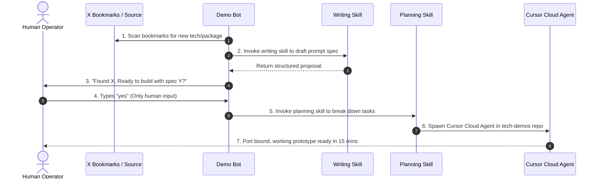

# 05. Chain skills instead of writing better prompts

The part worth stealing outright. Everyone else is tuning prompts. Palmer's Demo bot barely uses them: it calls his existing skills in sequence.

## The daily loop, in his words

> "Each day, it goes through my X bookmarks and finds a cool new technology, maybe an npm package or an agent skill. Then it drafts a prompt using my writing skill and runs it by me. If I approve the prompt, it uses my project-planning skill to fire up a new Cursor Cloud agent in a tech-demos repo."
>
> "In 15 minutes, I have a working prototype available in my Cursor app. I bind the port and play with it."

Count the parts: a source, a skill that writes, a human gate, a second skill that plans, a third system that builds. One working prototype a day, and his entire input is typing "yes".



He wrote no prompt. He assembled a pipeline out of parts he already owned.

## Where skills come from

1. You write them, or
2. You record them: open the bot with computer view, choose "Teach a task", do the job once while it watches. Ten minutes max.

The catch nobody mentions: a recorded skill is a draft. It captures your clicks, not your judgment. Add the rules yourself or it will do something confident and wrong at the first edge case.

## The template

```markdown
// one source, two skills, one gate
Every morning: read [source]. Pick the best item using [criteria].
Use my [writing skill] to draft the output.
Show it to me. Do not proceed without a yes.
On approval: use my [planning skill] to hand it to [system],
then report back when it is running.
```

One recorded workflow is a macro. Three skills a bot can call in order is a pipeline.
