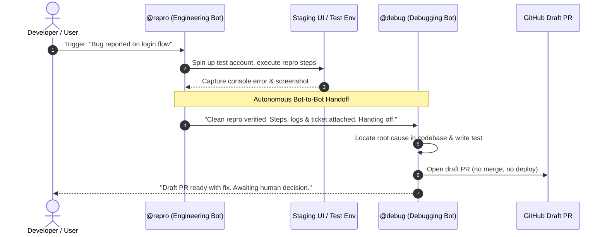

# 07. Let one bot hand work to another

The slow way to run three bots is to message each one, wait, then copy the output into the next. At that point you are middleware for your own agents.

## The real flow

SpaceXAI's engineering flow skips the human entirely: the Engineering bot reproduces the bug in the product UI, files the ticket, then hands the fix to a separate debugging bot. One bot decides another is better suited and transfers ownership.

Palmer, on seeing it the first time:

> "There's a little moment of joy the first time one asks another for help."



## Group threads

Group threads hold 2 to 6 bots. Write normally and let them work out who answers, use @ when one clearly owns it, and use @everyone sparingly. The docs actually say that.

Vincent on growth, once the crew exists:

> "Working with Grok Bot feels like I have eight arms like an octopus, with every arm in concert with the others, each performing the task the way I would."

Eight arms, not eight chat windows.

## The handoff template

```markdown
// assign ownership, then leave
@repro: reproduce this in staging on a fresh test account.
Return exact steps, expected vs actual, screenshots, console notes.
When the repro is clean, hand it to @debug yourself.

@debug: take it from repro, find the cause, open a draft PR.
Do not merge. Do not deploy.
Come back to me only when there is a decision to make.
```

If you are still copying output between bots in month two, the roster is wrong, not the product.
