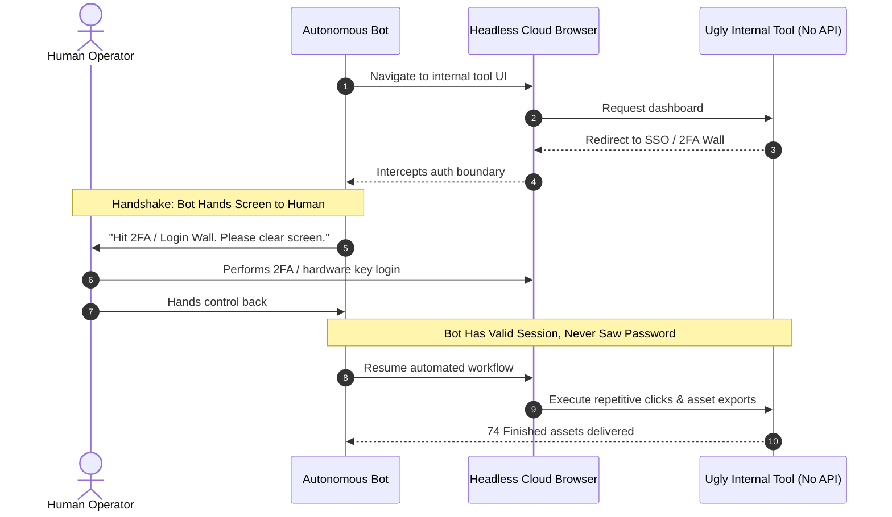

# 08. Point it at the ugly internal tool nobody will ever integrate

The leverage is not in the tool with the good API.

## The 74-asset story

Danny Limanseta, a designer in the early beta, pointed a bot at his own custom art generation web tool: a thing that will never get a connector. The bot studied the interface, wrote a separate prompt per asset, generated the images, cropped them to transparent PNGs, and dropped them back into his game.

**74 finished assets in about two hours.** Work that used to happen one at a time, across a week.

He also wired itch.io build uploads to fire on GitHub pushes, and generated UX flows and wireframes from a requirements doc through Figma MCP.

The best target is the janky internal thing your team clicks through daily that no vendor will ever automate. Roman, SpaceXAI product team, on why that lands:

> "There is a huge difference between 90% done and 100% done. Most AI gets you almost there. Grok Bot can finish the swing, because the work lands where a human would put it, in the actual tool."

## The credential mechanic (read this twice)

The bot drives its own cloud browser until it hits something only a human can clear. Palmer:

> "When a bot hits a wall only I can clear (a login, SSO, 2FA, a captcha, a payment) it hands me the computer. I do the hard thing, then I give the computer back."

You authenticate, hand the screen back, it resumes in the same session. That session then persists for every bot on your account until it expires.

For API keys it sends a secure form, so the value never lands in the transcript. You never paste a password into a chat. **The bot gets a session, not a secret.**



## The onboarding template

```markdown
Open [internal tool] and learn it before you touch anything.
Walk the interface, screenshot each screen, and tell me back
in your own words what it does and where things live.
Then do exactly one [task] end to end and show me the recording.
Ask me to sign in whenever you hit a wall. Never guess at credentials.
Change nothing outside [scope] without asking.
```

Making it learn the tool out loud first prevents most of the horror stories.
