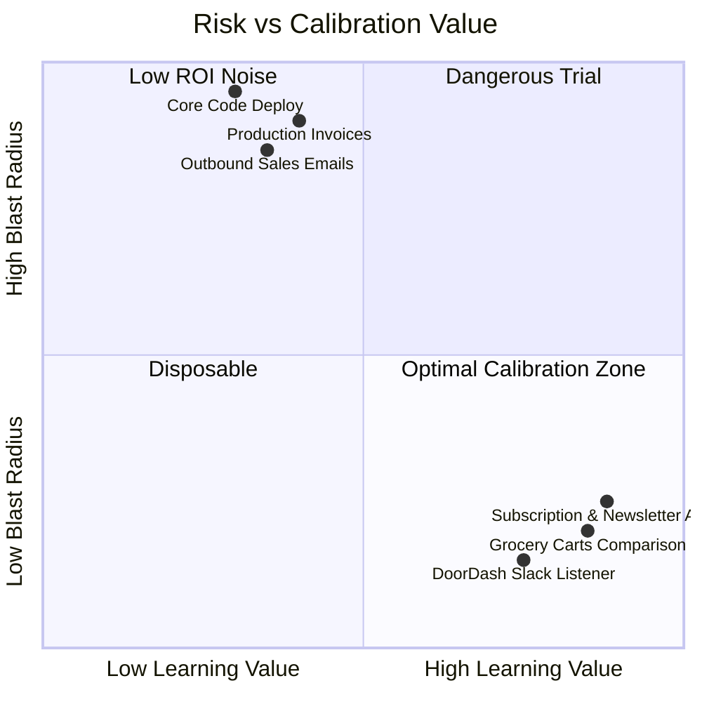

# 09. Give it errands, not just work

Two of the five bots on Palmer's roster have nothing to do with his job.

## The errand bots

- **Grocery bot:** compares products, quantities and prices across Instacart and Amazon delivery, manages two separate carts, weighs delivery costs against each other, and prompts him to order every Friday for Saturday delivery.
- **DoorDash bot:** watches Slack for drd.sh links, alerts him when a group order opens, digs into the menu on request, links him where to join.

That reads like a joke. It is the smartest thing in the setup.

## Why errands matter

Errands are where you find out what the bot is actually like: how it handles a confusing interface, what it does when a price doesn't match. Worst case is the wrong bag of groceries instead of the wrong email to a customer.

Danny ran the same play: he had a bot audit his subscriptions for forgotten recurring charges, then unsubscribe him from marketing lists. It found the charges. It missed some of the newsletters.

Better to learn that on a newsletter than on an invoice.



## The template

```markdown
Weekly errand, [day] at [time]:
Compare [items] across [site A] and [site B].
Build the cart wherever total cost including delivery is lower.
Show me both carts side by side with the difference in dollars.
Do not place the order. Bring it to me and wait.
```

Two weeks on the low-stakes surface tells you how much rope to give it everywhere else.
