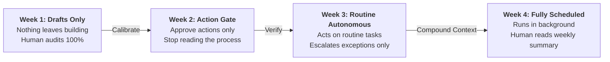

# 10. The hard part is training yourself to stop checking

Emma, operations at SpaceXAI, on the start:

> "When I first started, I was checking in on them every 15 minutes and micromanaging the Bots to the point where they asked me why I kept asking so many questions. Now I let it do its thing and it's just gotten better with time."

Everything else in this playbook is a setup problem you can solve in an afternoon. This one takes about a month.

Every time you break a run to re-ask something, you pay tokens to relearn what the profile file already knew. Context compounds, but only if you leave it alone.

The other end of the ramp, Bennett on sales:

> "I showed Grok Bot a workflow once and now I just fully trust it to run forever. I feel like I'm 2-3x more efficient because it does it without me verifying and reviewing."

## The scheduled handover

Don't wait to feel ready. Schedule it:

| Week | Level of trust |
|---|---|
| 1 | It drafts, nothing leaves the building, I read everything |
| 2 | I approve each action but stop reading the process |
| 3 | It acts on routine cases, escalates only exceptions |
| 4 | It runs on a schedule, I read the weekly summary |



## The standing rule, from week 1

```markdown
Interrupt me only for an approval, missing data, or something
outside the scope we agreed. Otherwise finish and show me.
```

Put that standing rule in the profile file on day one. It is the difference between a teammate and an expensive notification.
